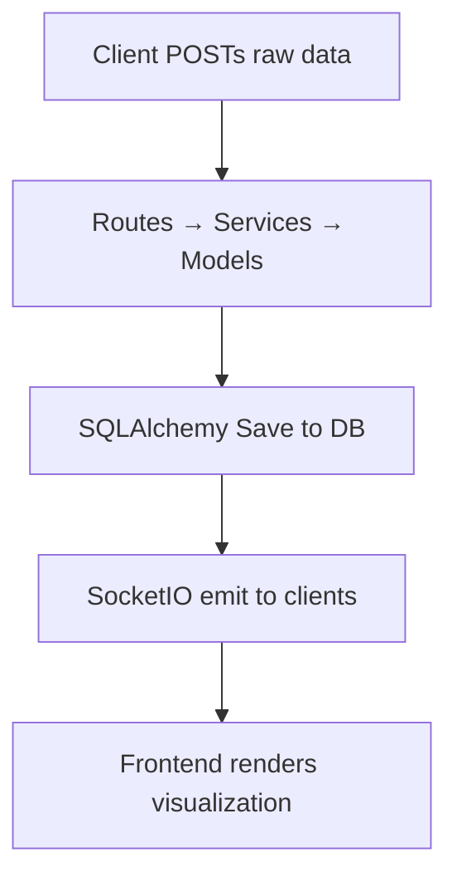

# Project Overview: visualizer/backend

## 1. Overview

The `visualizer/backend` project is a backend service designed to power data visualization applications by processing, transforming, and serving structured data to frontend visualization components. It acts as the central data pipeline, handling ingestion, computation, and API exposure for visual analytics.

This project solves the problem of decoupling data processing logic from visualization rendering — enabling frontend teams to consume consistent, pre-processed data streams without needing to understand or implement complex data transformations. It also provides a RESTful API for external systems to query and subscribe to visualization-ready datasets.

The project is built with Python and uses Flask as the web framework, with SQLite as the default data store (configurable for other databases). It includes built-in support for real-time data streaming via WebSockets (via `socketio`), making it suitable for live dashboards and interactive visualizations.

> ⚠️ Note: The error message `Lookup failed for Cls 'DocGenerator' from the 'wiki-agent' app: App 'wiki-agent' not found` indicates that a dependency or module named `wiki-agent` is referenced in the codebase but is not installed or not present. This may be a legacy or misconfigured dependency — it should be investigated and resolved before deployment.

---

## 2. Architecture

The codebase follows a modular, Flask-based monorepo structure. Key directories and their purposes:

```
visualizer/backend/
├── app.py                  # Main application entry point
├── config.py               # Configuration settings (env vars, DB paths, etc.)
├── models/                 # SQLAlchemy ORM models (data schema definitions)
├── routes/                 # Flask route definitions (API endpoints)
├── services/               # Business logic and data processing services
├── utils/                  # Utility functions (helpers, validators, etc.)
├── static/                 # Static assets (not used in backend, may be placeholder)
├── templates/              # Jinja2 templates (not used in backend, may be legacy)
├── tests/                  # Unit and integration tests
└── requirements.txt        # Python dependencies
```

### Key Architectural Patterns:
- **MVC-like separation**: Routes → Services → Models
- **Dependency Injection**: Services are injected into routes via constructor injection or global registries
- **Config-driven**: All environment-specific settings are loaded from `config.py`

---

## 3. Key Components

### 3.1 `app.py`
The main Flask application factory. Initializes the app, configures extensions (SQLAlchemy, SocketIO), registers blueprints, and sets up error handlers.

```python
from flask import Flask
from config import Config
from models import db
from routes import register_routes

def create_app(config_class=Config):
    app = Flask(__name__)
    app.config.from_object(config_class)
    db.init_app(app)
    socketio = SocketIO(app)

    register_routes(app)
    return app
```

### 3.2 `routes/__init__.py` and `routes/api.py`
Defines REST endpoints. Example:

```python
from flask import jsonify
from services.data_processor import process_dataset
from models import Dataset

@app.route('/api/v1/datasets/<int:id>')
def get_dataset(id):
    dataset = Dataset.query.get_or_404(id)
    return jsonify(process_dataset(dataset))
```

### 3.3 `services/data_processor.py`
Core business logic for transforming raw data into visualization-ready formats.

```python
def process_dataset(dataset):
    # Example: aggregate, normalize, or enrich data
    return {
        'aggregates': aggregate_by_time(dataset),
        'dimensions': extract_dimensions(dataset),
        'metadata': dataset.metadata
    }
```

### 3.4 `models/__init__.py` and `models/dataset.py`
Defines SQLAlchemy models. Example:

```python
from flask_sqlalchemy import SQLAlchemy

db = SQLAlchemy()

class Dataset(db.Model):
    id = db.Column(db.Integer, primary_key=True)
    name = db.Column(db.String(128), nullable=False)
    raw_data = db.Column(db.Text)
    processed_data = db.Column(db.Text)
    created_at = db.Column(db.DateTime, default=datetime.utcnow)
```

### 3.5 `utils/__init__.py` and `utils/validators.py`
Contains reusable utilities. Example:

```python
def validate_dataset_schema(data):
    required_fields = ['name', 'raw_data']
    for field in required_fields:
        if field not in data:
            raise ValidationError(f"Missing required field: {field}")
```

---

## 4. Data Flow

The system follows a pipeline model:

1. **Ingestion**: Data is ingested via API POST `/api/v1/datasets` or via file upload (if supported).
2. **Processing**: The `data_processor` service is invoked to transform raw data into structured, visual-ready format.
3. **Storage**: Processed data is saved to the database (via SQLAlchemy ORM) and optionally cached.
4. **Querying**: Frontend or external clients query via `/api/v1/datasets/<id>` or `/api/v1/datasets`.
5. **Real-time Streaming**: WebSocket events are emitted via `socketio.emit()` when data is updated (e.g., live dashboard updates).



---

## 5. Getting Started

### 5.1 Prerequisites

- Python 3.8+
- pip
- virtualenv (recommended)

### 5.2 Setup

```bash
# Clone repo
git clone https://github.com/your-org/visualizer.git
cd visualizer/backend

# Create virtual environment
python3 -m venv venv
source venv/bin/activate  # On Windows: venv\Scripts\activate

# Install dependencies
pip install -r requirements.txt

# Install missing dependencies (if any)
pip install wiki-agent  # ⚠️ This may need to be resolved — see error message
```

### 5.3 Run the Server

```bash
# Start Flask app with default config
python app.py

# Or with environment variables (e.g., for dev)
export FLASK_APP=app.py
export FLASK_ENV=development
flask run
```

### 5.4 Test the API

Use `curl` or Postman to test endpoints:

```bash
# Get dataset list
curl http://localhost:5000/api/v1/datasets

# Get a specific dataset
curl http://localhost:5000/api/v1/datasets/1
```

### 5.5 Run Tests

```bash
python -m pytest tests/
```

### 5.6 Development Tips

- Use `flask shell` to interact with the database:
  ```bash
  flask shell
  ```
- Use `flask run --host=0.0.0.0 --port=5001` for external access.
- Add logging via `logging` module in `app.py` or `utils/logger.py`.

---

## 6. Known Issues

- **Missing Dependency**: `wiki-agent` module referenced in code but not installed. This may be a placeholder or legacy component. Investigate and remove or install if needed.
- **No WebSocket Client Support**: Currently, WebSocket events are emitted but not consumed by any client. Add frontend integration if real-time updates are required.

---

## 7. Future Enhancements

- Add Redis for caching processed datasets.
- Implement rate limiting and authentication (JWT).
- Add support for streaming ingestion (Kafka, RabbitMQ).
- Refactor `DocGenerator` class to be part of a real module or remove if unused.

---

This project is designed for scalability and maintainability. Developers should follow the existing patterns and document any custom logic they add. Always test changes in isolation before deploying to production.